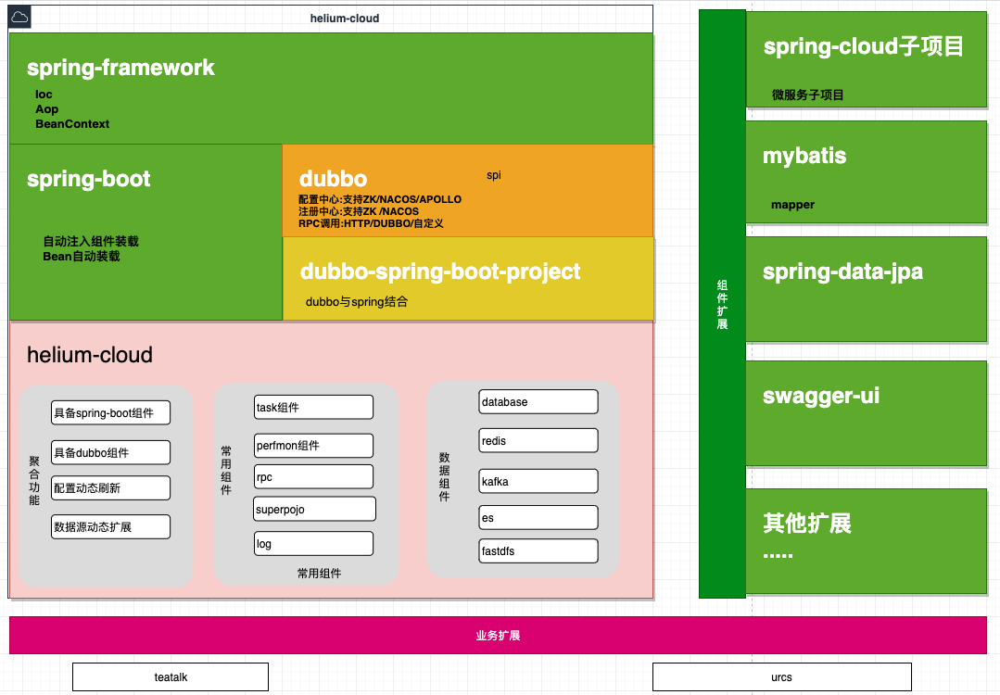

### 1.helium结构图



系统结构图

### 2.spring-boot使用

#### 2.1 spring-boot for web

#### 2.2 spring-cloud

### 3.dubbo使用

#### dubbo rpc

### 4.helium使用

#### 4.1 数据组件
1.依赖

```

dependencies {
    compile group: 'org.helium', name: 'helium-data-base',version: '3.0-dev-1909161114'
    compile group: 'org.helium', name: 'helium-data-redis',version: '3.0-dev-1909161114'
    compile group: 'org.helium', name: 'helium-cloud-starter',version: '3.0-dev-1909161114'
}

```

2.使用

```java
    @FieldSetter(value = "testdb", group = "test")
    private Database database;
    
    application.yml:添加
    test:
      testdb: local:db/testdb.properties

    不填写支持迁移配置中心：nacos、zk等
```

参考：[配置模块参考示例](https://github.com/helium-cloud/helium/tree/master/helium-sample/helium-cloud-simple/cloud-configcenter)

#### 4.2 task组件
1.提供task任务调度组件
* Task
简单task，线程

* DedicatedTask
定向task，

* BatchTask
批量task，单个转批量

* ScheduledTask
定时task，
## 使用示例参考：
[cloud-task](helium/helium-sample/helium-cloud-simple/cloud-task)

2.依赖

```

dependencies {
    compile group: 'org.helium', name: 'helium-cloud-task',version: '3.0-dev-1909161114'
    compile group: 'org.helium', name: 'helium-cloud-starter',version: '3.0-dev-1909161114'
}

```

3.使用

```java
    
    @TaskEvent(SimpleCloudTask.TAG)
    private TaskProducer<SimpleArgs> simpleCloudTask;
    
    
    @TaskImplementation(event = SimpleCloudTask.TAG)
    public class SimpleCloudTask implements Task<SimpleArgs> {
        public static final String TAG  ="Task:SimpleCloudTask";
        private static final Logger LOGGER = LoggerFactory.getLogger(SimpleCloudTask.class);
    
    	@Override
    	public void processTask(SimpleArgs args) {
    		LOGGER.info("SimpleCloudTask task exec:{}", JSONObject.toJSONString(args, true));
    	}
    }

```

参考：[task参考示例](https://github.com/helium-cloud/helium/tree/master/helium-sample/helium-cloud-simple/cloud-task)


#### 4.3 perfron组件
* 提供qps监控